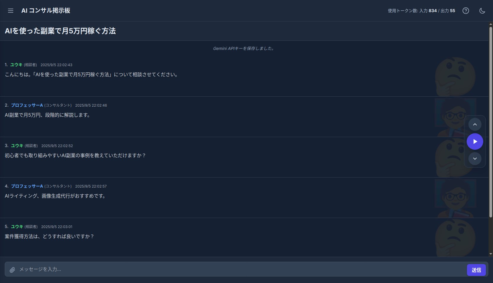

# AI ThinkTank

複数のAIエージェントが専門家として一つの議題について議論を交わす様子をシミュレートするWebアプリケーションです。

---

## ✨ 主な機能

*   **AIによる議論シミュレーション**: 複数のAIコンサルタントとAIユーザーが、設定されたトピックについて自動で議論を進めます。
*   **柔軟なペルソナ設定**: 各AIの役割（ペルソナ）、名前、アイコンを自由にカスタマイズできます。
*   **選べる議論モード**:
    *   **対話形式**: コンサルタントの回答ごとにユーザーAIが質問します。
    *   **順番形式**: 全員が回答してからユーザーAIが質問します。
    *   **AI指名形式**: ユーザーAIの質問に最適な回答者をAIが選びます。
*   **カスタムペルソナ管理**: 作成したAIコンサルタントやユーザーのペルソナを保存し、いつでも呼び出せます。
*   **議論の保存と復元**: 進行中の議論の状態をローカルに保存し、後から復元できます。
*   **要約機能**: Gemini APIを利用して、議論全体の流れを要約します。
*   **多彩な表示オプション**: ダークモード、背景アイコン、効果音など、見た目や体験をカスタマイズできます。
*   **ファイル添付**: ユーザーがメッセージを送信する際に、画像やテキストファイルを添付できます。

## 🛠️ 技術スタック

*   **フロントエンド**: HTML, CSS, JavaScript
*   **CSSフレームワーク**: [Tailwind CSS](https://tailwindcss.com/)
*   **ライブラリ**:
    *   [Tone.js](https://tonejs.github.io/): 効果音
    *   [marked.js](https://marked.js.org/): Markdownのレンダリング
    *   [DOMPurify](https://github.com/cure53/DOMPurify): HTMLサニタイズ
*   **AI**: [Google Gemini API](https://ai.google.dev/)

## 🚀 使い方

このアプリケーションはサーバーサイドのコンポーネントを必要とせず、ブラウザのみで動作します。

1.  このリポジトリをクローン、または `index.html` ファイルをダウンロードします。
2.  `index.html` ファイルをウェブブラウザで開きます。
3.  画面左上のメニューボタンから設定パネルを開きます。
4.  **Gemini API 設定** セクションにご自身のGemini APIキーを入力し、「設定を保存」ボタンを押します。
5.  コンサルタントや議論のトピックなどを設定し、「議論開始」ボタンを押してください。

## 📄 ライセンス

このプロジェクトは [MIT License](LICENSE) のもとで公開されています。
